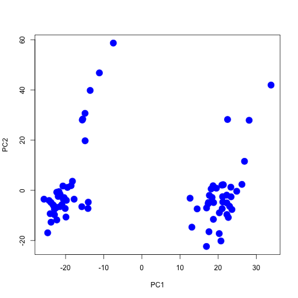
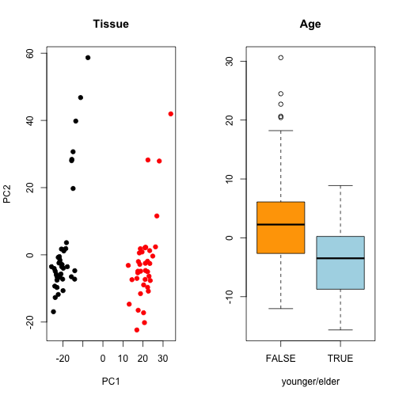
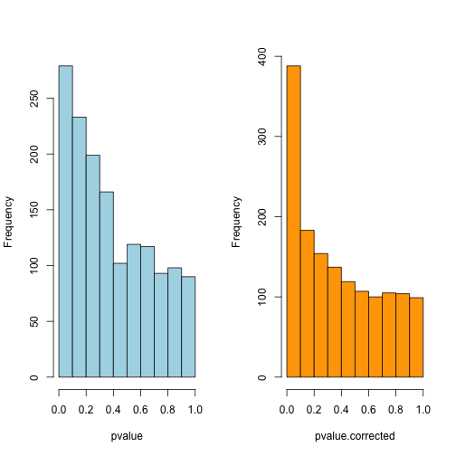
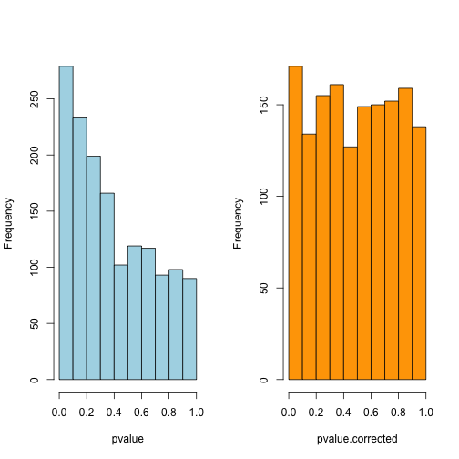
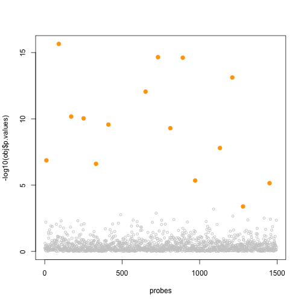

Removing Unwanted Variation in Epigenome-Wide Association Studies 
========================================================
author: Olivier François (Univ. Grenoble-Alpes)
date: June 8th, 2017

Outline
========================================================

**Contents of this talk**:

- Methylation Array data (example)
- Presentation of Challenge 2
- (Not the best) solution for mediation analysis

Methylation array data
========================================================

- Methylation of cytosine bases in DNA CpG islands is important in epigenetic regulation mechanisms.
- Hypermethylation of CpG islands located in the promoter regions of tumor suppressor genes has been established as one mechanism for gene regulation in cancer. 
- Arrays enable high-throughput profiling of DNA methylation status of CpG islands.
- The **Beta-value**, ranging from 0 to 1, is used to measure the percentage of methylation.


Methylation Array (reduced data set)
========================================================

**Data for challenge 2**:
- 1496 beta-normalized methylation profiles
- 78 individivuals
- Sun exposure, cancer phenotype, age, gender, tissue sample 
- **Vandiver et al. 2015** Age and sun exposure-related widespread genomic blocks of hypomethylation in nonmalignant skin. Genome Biology 16, 16:80.


Methylation Array (reduced data set)
========================================================

**Data for challenge 2:**
- 1496 beta-normalized methylation profiles
- 78 tissue samples 
- Sun exposure, cancer phenotype, age, gender, tissue type


```r
data2 <- read.table(link.to.challenge2)
Expset <- data2[,1:1496]
```


Question of interest and some difficulties
========================================================


- Which probes are found in the mediation path from exposure to phenotype? 
- Potentially **many mediators** (and they are the needles in the haystack)
- **Confounding factors** must be removed before evaluation of mediation effects


Confounding factors
========================================================

**Evaluating structure in the methylation array**:
- Perform a principal component analysis of the methylation data


Clusters explained by tissue type and age
========================================================




Removing systematic variation from the EWAS (of phenotype)
========================================================
**Correction with 2 principal components**:



Using the R package "cate"
========================================================




Mediation analysis with methylation arrays (my attempt)
========================================================

A **four-step 'outlier' detection** approach:

- Compute z-scores (zx) for the association **Expset $\sim$ exposure**
- Compute z-scores (zy) for the association **Expset $\sim$ phenotype**
- Combine zx and zy linearly using **PCA**
- Compute p-values from the resulting scores by using **fdrtool** 


My R function 
========================================================

**Class "covfefe"** (English translation: "the worst I can do"): 
- contains z-scores, pvalues and candidate probes (FDR)


```r
obj <- mycovfefe(
        Expset, 
        phenotype = data2$phenotype, 
        exposure = data2$exposure, 
        k = 2)
```


Results: Histogram of p-values
========================================================


```r
p.values = obj$p.values
hist(p.values, col = "green3")
```


Results: P-value plot (log10) 
========================================================




Challenge 2
========================================================

**Download the data for challenge 2**:
- Propose your own approach to mediation based on Sobel tests, hima, etc
- Or/and improve "mycovfefe"
- Send your candidate list to the web application.

- This **.Rmd presentation** contains all scripts for reproducibility


