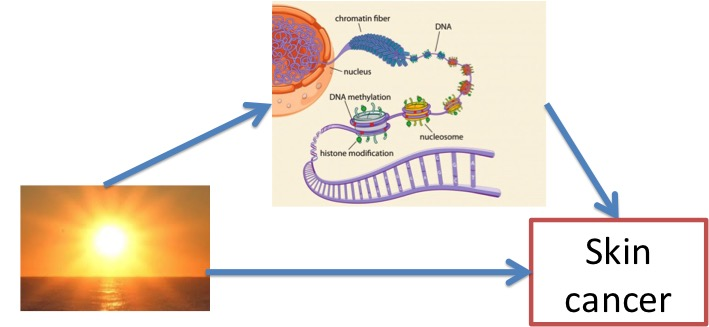

# Mediation with a single mediator 

## Download and read the data file stored on github

```{r,warning=FALSE,message=FALSE}
require(data.table)
nb_med<-5000
if (!file.exists("challenge1.txt"))
  download.file("https://goo.gl/iLFGeC",destfile="challenge1.txt")
data1<-fread("challenge1.txt",header=TRUE,data.table=FALSE)
print(dim(data1))
cor(data1$exposure,data1$phenotype)
```

## Step 1 of Baron and Kenny procedure 

We show how to perform Baron and Kenny procedure to test that the effect of exposure on the phenotype is mediated by the first "epigenetic" marker.

We start by [Step 1 of Baron and Kenny method](https://goo.gl/NG0yro) to test that the exposure is a significant predictor of the phenotype.

```{r}
step1<-summary(lm(phenotype~exposure,data=data1))
```

We find that the effect of *exposure* on  *phenotype* is significant because the P-value is equal to `r sprintf("%f",coef(step1)[2,"Pr(>|t|)"])`.

## Step 2 and 3 of Baron and Kenny procedure 

Then, we perform [Step 2 and 3 of Baron and Kenny procedure](https://goo.gl/NG0yro).
```{r}
x<-1
p_step2<-coef(summary(lm(data1[,x]~data1$exposure)))[2,"Pr(>|t|)"]
p_step3<-coef(summary(
  lm(data1$phenotype~data1[,x]+data1$exposure)))[2,"Pr(>|t|)"]
cat("P-value Step 2 ",p_step2,", P-value Step 3 ",p_step3,"\n")
```
Because there is one P-value larger than $0.05$, we conclude that there is no evidence that the first marker is involved in mediation.

## Including Sobel test in Baron and Kenny procedure 

The P-value of the [Sobel test](https://en.wikipedia.org/wiki/Sobel_test) is usually included as a fourth condition in Baron and Kenny procedure (see e.g.  [Kupers et al. 2015](https://www.ncbi.nlm.nih.gov/pmc/articles/PMC4588868/)). The Sobel statistic is computed to test that the product of the effect of the exposure on the mediator and the effect of the mediator on the phenotype (while controlling for exposure) is different from 0.
```{r,message=FALSE}
require(multilevel)
z_sobel<-sobel(
  pred=data1$exposure,med=data1[,x],out=data1$phenotype)$z.value
p_sobel<-2*pnorm(abs(z_sobel),lower.tail=F)
cat("P-value Sobel",p_sobel,"\n")
```
Same conclusion as before.

# Mediation with multiple mediators 

## Challenges 1 and 2 | epigenetic mediation of sun exposure on skin cancer risk



## Challenges 1 and 2
- Objective: Find the epigenetic markers involved in mediation.
- Main difficulty: There are a large number of epigenetic markers ($5,000$ in challenge 1) (**High-Dimension** Mediation Data Challenge).
- Evaluation: the ranking of the participants will be based on the $F1$ score that depends on false discovery rate (FDR) and of statistical power.

## Mediation with multiple mediators

Now, you should analyse the full data, not only mediator number one.

Some R packages might be useful (or not) including [fdrtool](https://cran.r-project.org/web/packages/fdrtool/index.html), [qvalue](http://bioconductor.org/packages/release/bioc/html/qvalue.html), and [hima](https://github.com/YinanZheng/HIMA).

